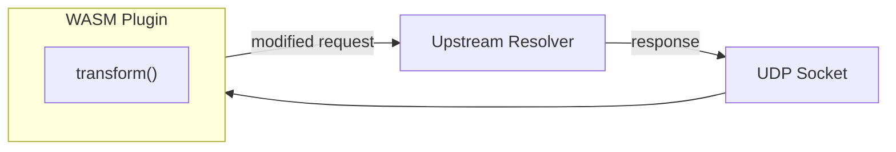

# DAWN

**DNS Anti-censorship WebAssembly Nexus**

DAWN is a DNS proxy that democratizes anti-censorship by allowing anyone to write pluggable, efficient WebAssembly modules for DNS packet transformation. Write your evasion technique once in any language that compiles to WASM, and deploy it anywhere.

## Why DAWN?

Censorship evasion techniques often require custom protocol manipulation, but implementing them typically means:
- Forking existing tools and maintaining patches
- Writing in a specific language
- Dealing with platform-specific builds

DAWN solves this by separating the **transport** (a fast, async Rust proxy) from the **transformation logic** (portable WASM plugins). Anyone can write a plugin in Rust, C, Zig, or any language targeting WASM, and share it with the community.

## Quick Start

```bash
# Build the release bundle
nix build .#release

# Run the proxy with a plugin
./result/bin/dawn --plugin ./result/lib/dawn_doubler.wasm

# Test it
dig @127.0.0.1 -p 1053 example.com A
```

## Architecture



## Writing Plugins

Plugins are WASM modules that transform DNS packets. See the **[Plugin Development Guide](plugins/README.md)** for complete documentation, including:

- Full ABI reference and memory protocol
- Step-by-step project setup
- DNS packet format reference
- Testing strategies
- Binary size optimization

Quick example - a minimal plugin that passes packets through unchanged:

```rust
#[no_mangle]
pub unsafe extern "C" fn transform(
    input_ptr: *const u8, input_len: u32,
    output_ptr: *mut u8, _output_capacity: u32,
) -> u32 {
    for i in 0..input_len as usize {
        *output_ptr.add(i) = *input_ptr.add(i);
    }
    input_len
}

// ... plus alloc/dealloc exports (see full guide)
```

Check out the existing plugins in `plugins/` for real-world examples.

## Building

Requires [Nix](https://nixos.org/) with flakes enabled.

```bash
# Build the complete release bundle (binaries + plugins + data)
nix build .#release

# Build components separately (release)
nix build .#dawn           # Static musl binaries (proxy + tester)
nix build .#doublerPlugin  # WASM plugin
nix build .#iqueryPlugin   # WASM plugin

# Build everything in debug mode (faster, for CI/testing)
nix build .#check

# Development shell with full toolchain
nix develop
cargo test
cargo build -p dawn_doubler --target wasm32-unknown-unknown --release
```

## CLI Reference

### dawn

```
DNS Anti-censorship WebAssembly Nexus - A DNS proxy with pluggable WASM transforms

Usage: dawn [OPTIONS] --plugin <PLUGIN>

Options:
      --plugin <PLUGIN>      Path to the WASM plugin module
      --listen <LISTEN>      Address to listen on [default: 127.0.0.1:1053]
      --upstream <UPSTREAM>  Upstream DNS server [default: 8.8.8.8:53]
  -h, --help                 Print help
```

### dawn-tester

```
Test DNS censorship detection and evasion effectiveness

Usage: dawn-tester [OPTIONS]

Options:
      --plugins <PLUGINS>          Comma-separated WASM plugin paths
      --domains <DOMAINS>          Domain list file [default: data/censored.txt]
      --forged-ipv4 <FORGED_IPV4>  Forged IPv4 addresses file [default: data/forged.ipv4]
      --forged-ipv6 <FORGED_IPV6>  Forged IPv6 addresses file [default: data/forged.ipv6]
      --upstream <UPSTREAM>        Upstream DNS server [default: 8.8.8.8:53]
      --concurrency <CONCURRENCY>  Number of concurrent requests [default: 10]
  -h, --help                       Print help
```

## Included Plugins

### doubler

Duplicates A, AAAA, and CNAME questions in DNS queries using compression pointers. This can confuse censors that only inspect the first question.

### iquery

Sets the IQUERY (inverse query) opcode in DNS headers. Some censors don't inspect packets with unusual opcodes.

## License

This project is licensed under the GNU General Public License v3.0 only - see the [LICENSE](LICENSE) file for details.

## Contributing

Contributions welcome! Whether it's new evasion plugins, protocol support, or documentation improvements.
