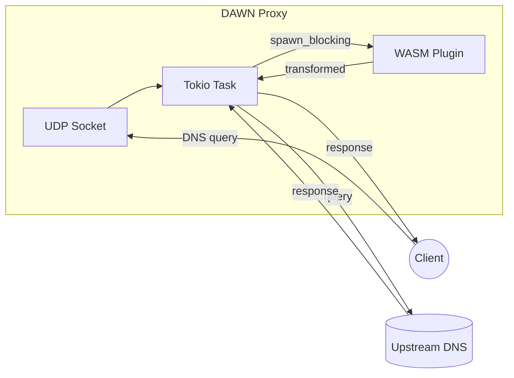

# DAWN

**DNS Anti-censorship WebAssembly Nexus**

DAWN is a DNS proxy that democratizes anti-censorship by allowing anyone to write pluggable, efficient WebAssembly modules for DNS packet transformation. Write your evasion technique once in any language that compiles to WASM, and deploy it anywhere.

## Why DAWN?

Censorship evasion techniques often require custom protocol manipulation, but implementing them typically means:
- Forking existing tools and maintaining patches
- Writing in a specific language
- Dealing with platform-specific builds

DAWN solves this by separating the **transport** (a fast, async Rust proxy) from the **transformation logic** (portable WASM plugins). Anyone can write a plugin in Rust, C, Zig, or any language targeting WASM, and share it with the community.

## Quick Start

```bash
# Build everything
nix build .#bundle

# Run the proxy with a plugin
./result/bin/dawn --plugin ./result/lib/dawn_doubler.wasm

# Test it
dig @127.0.0.1 -p 1053 example.com A
```

## Architecture



The plugin module is pre-compiled once at startup (`InstancePre`), making per-request instantiation fast. Each request spawns a blocking task for parallel WASM execution.

## Writing Plugins

Plugins are WASM modules that transform DNS packets. See the **[Plugin Development Guide](plugins/README.md)** for complete documentation, including:

- Full ABI reference and memory protocol
- Step-by-step project setup
- DNS packet format reference
- Testing strategies
- Binary size optimization

Quick example - a minimal plugin that passes packets through unchanged:

```rust
#![cfg_attr(target_arch = "wasm32", no_std)]

#[no_mangle]
pub extern "C" fn transform(
    input_ptr: *const u8, input_len: u32,
    output_ptr: *mut u8, _output_capacity: u32,
) -> u32 {
    unsafe {
        core::ptr::copy_nonoverlapping(input_ptr, output_ptr, input_len as usize);
    }
    input_len
}

// ... plus alloc/dealloc exports (see full guide)
```

Check out the existing plugins in `plugins/` for real-world examples.

## Building

Requires [Nix](https://nixos.org/) with flakes enabled.

```bash
# Build the complete bundle (binaries + plugins + data)
nix build .#fullBundle

# Build components separately
nix build .#dawn           # Static musl binaries (proxy + tester)
nix build .#doublerPlugin  # WASM plugin
nix build .#iqueryPlugin   # WASM plugin

# Development shell with full toolchain
nix develop
cargo test
cargo build -p dawn_doubler --target wasm32-unknown-unknown --release
```

## CLI Reference

```
dawn --plugin <path> [--listen <addr>] [--upstream <addr>]

Options:
  --plugin <path>      Path to WASM plugin module (required)
  --listen <addr>      Listen address [default: 127.0.0.1:1053]
  --upstream <addr>    Upstream DNS server [default: 8.8.8.8:53]
```

## Included Plugins

### doubler

Duplicates A, AAAA, and CNAME questions in DNS queries using compression pointers. This can confuse censors that only inspect the first question.

### iquery

Sets the IQUERY (inverse query) opcode in DNS headers. Some censors don't inspect packets with unusual opcodes.

## License

[TODO: Add license]

## Contributing

Contributions welcome! Whether it's new evasion plugins, protocol support, or documentation improvements.
